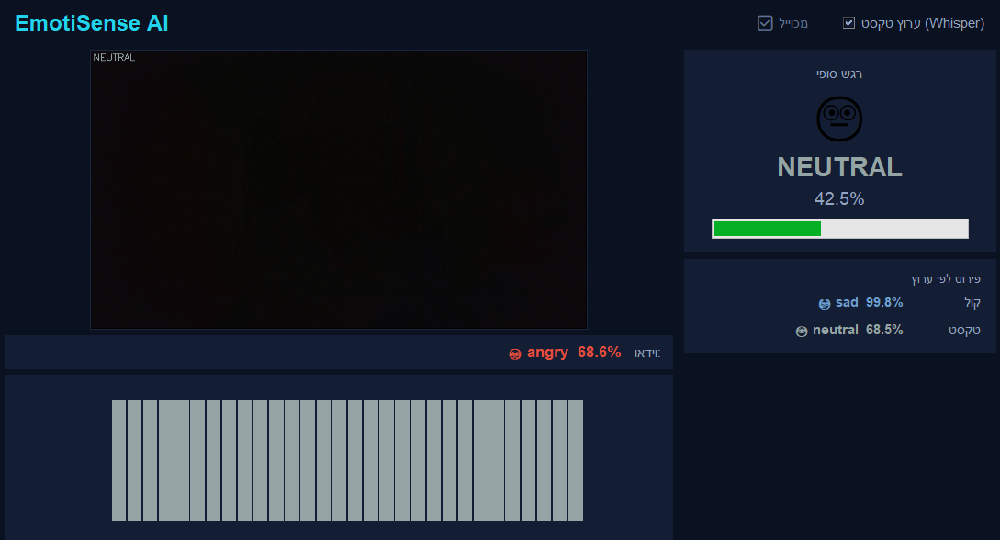

# EmotiSense AI

**Real-time multimodal emotion recognition.**
EmotiSense reads human emotion from three independent channels at once — your **face**, your **voice tone**, and the **content of your speech** — and fuses them into a single, confidence-weighted result, live.

<p align="center">
  
</p>

<p align="center">
  <em>Live interface: webcam feed with per-frame facial emotion (left), the fused final emotion and its confidence (top-right), and the per-channel breakdown for voice and text (bottom-right).</em>
</p>

---

## ✨ Why EmotiSense?

Most emotion detectors look at a single signal and are easily fooled — a smile can hide a sad tone; angry words can be spoken calmly. EmotiSense watches **three signals in parallel** and lets the **most confident channel lead**, so the final read is far more robust than any single channel alone. It even flags **emotional contradictions** (e.g. positive words in a negative tone and expression — the fingerprint of sarcasm or masking).

---

## 🧠 How It Works

Three channels, each on its own thread so nothing blocks anything else, all merged by a confidence-weighted fusion engine.

| Channel | What it reads | Model |
|---------|---------------|-------|
| 🎥 **Video** | Facial expression | [DeepFace](https://github.com/serengil/deepface) emotion analysis with the `yunet` face detector |
| 🎙️ **Audio** | Voice **tone** (energy, pitch) — *how* you speak | A CNN over a 128×130 mel-spectrogram, softmax over 7 emotions |
| 📝 **Text** | Speech **content** — *what* you say | [faster-whisper](https://github.com/SYSTRAN/faster-whisper) speech-to-text → `j-hartmann/emotion-english-distilroberta-base` |

All channels map to the same fixed set of **7 emotions**:

`neutral · happy · sad · angry · fearful · disgust · surprised`

### Data flow

```
 [Video thread]              [Audio thread]                [Text thread]
 camera (OpenCV)             AudioCapture stream           AudioCapture stream
 DeepFace (yunet)            mel-spectrogram + CNN         faster-whisper + distilroberta
      │ probs                     │ probs                        │ emotion + conf
      ▼                           ▼                              ▼
 video_queue                 audio_queue                    text_out_queue
      └───────────────┬───────────────┴──────────────────────────┘
                      ▼
              _update_ui()  (main thread, every 80 ms)
                      │  → fusion.py  (weighted combine + temporal smoothing)
                      ▼
              tkinter GUI  (live video · final emotion % · per-channel breakdown · chart)
```

The audio and text channels share **one continuous microphone stream** (`AudioCapture`), so no audio is ever lost between reads.

---

## 🔗 The Fusion Engine

The core idea: **a channel that is more confident should have more influence.** Weights are the **square** of each channel's confidence (`confidence²`), which amplifies the gap between a confident and a hesitant channel.

```
weight_i = confidence_i²  /  Σ confidence²
final_probs = Σ ( weight_i · probs_i )
```

**Worked example** — video says *happy* (85%), audio says *sad* (40%), text says *happy* (70%):

```
weights  = 85² : 40² : 70²  =  7225 : 1600 : 4900
         → video 52.6%   audio 11.7%   text 35.7%
```

Video and text agree on **happy** (88.3% of the weight) → final emotion **happy**, confidence ≈ 70%. The audio channel (sad) disagrees, so a **contradiction flag** is raised.

---

## 🚀 Getting Started

### Requirements

- **Windows** with a **webcam** and a **microphone**
- **Python 3.10** (bundled as the `emotion_env` virtual environment)

### Run

```powershell
.\emotion_env\Scripts\python.exe main.py
```

Startup loads all models first (~10–15 s). Once the window appears, all three channels run in parallel.

> 💡 **Tip:** the text channel is tuned for **English**. Speak in short, clear sentences for the best speech-to-emotion results.

---

## 📁 Project Structure

| File | Purpose |
|------|---------|
| `main.py` | Main application — orchestrates the three channels and the tkinter GUI |
| `fusion.py` | The fusion engine — combines the channels into one final emotion |
| `video_emotion.py` | Standalone facial-emotion detector (DeepFace) |
| `audio_emotion.py` | Voice-tone emotion detector (CNN over a mel-spectrogram) |
| `audio_stream.py` | Continuous, gapless microphone capture shared by audio + text |
| `text_emotion.py` | Speech → text (faster-whisper) → emotion (distilroberta) |
| `model_weights.npz` | Trained weights for the audio CNN |
| `DOCUMENTATION.md` | Deep-dive code documentation |

---

## ⚙️ Key Configuration

Tunable constants live at the top of `main.py`:

| Constant | Meaning |
|----------|---------|
| `UI_UPDATE_MS = 80` | GUI refresh interval (~12 fps) |
| `SMOOTHING_ALPHA = 0.15` | Temporal smoothing (higher = more reactive, less stable) |
| `AUDIO_WEIGHT = 0.35` | Down-weights audio (voice tone is less reliable than the face) |
| `DEEPFACE_BACKEND = 'yunet'` | Face detector — OpenCV-based, does not clash with TensorFlow |

---

## 🛠️ Notable Technical Decisions

- **`yunet`, not `retinaface`.** `retinaface`/`mtcnn` are TensorFlow-based and crash once the audio model's `tf_keras` is loaded (`KerasTensor` / `streams::fork` errors). `yunet` is OpenCV-based and safe, with an automatic fallback to `opencv`.
- **Torch loaded on the main thread.** The PyTorch text classifier is loaded *before* the TensorFlow channels start, to avoid a torch/TensorFlow concurrency crash.
- **One continuous audio stream** shared by both audio channels — gapless capture.
- **Confidence² fusion + temporal smoothing** (`0.15·new + 0.85·old`) — stable, flicker-free results.
- **`sys.stdout.reconfigure('utf-8')`** at startup so Unicode console output never crashes on legacy Windows code pages.

---

## 📖 Learn More

For a full module-by-module walkthrough of the code, see **[DOCUMENTATION.md](DOCUMENTATION.md)**.
